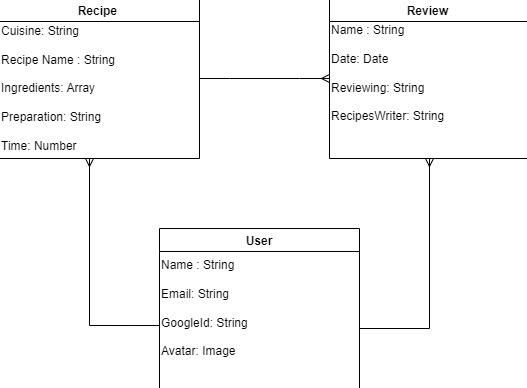

# Recipe Book
## Date: 5/23/2024

### By: Osama, Jenan Alawadhi, Jenan, Fatima 

#### Osama's:  [GitHub](https://github.com/OsamaMohammad61) | [LinkedIn](https://www.linkedin.com/in/osama-mohammad-59baa3265/)
#### Fatima Alajmis's:  [LinkedIn](https://www.linkedin.com/in/fatema-alajmi-0338b0290?utm_source=share&utm_campaign=share_via&utm_content=profile&utm_medium=ios_app)
#### Jenan Alawadhi's: [GitHub](https://github.com/jenanalawadhi1) | [LinkedIn](http://www.linkedin.com/in/jenan-alawadhi)
#### Jenan's :
***

## ***Description***
#### Welcome to our culinary haven! Our website greets visitors with a welcoming page featuring an overview of our platform and a prompt to log in. Once logged in, users can explore a diverse array of cuisines, each offering a selection of delectable recipes. Users can seamlessly navigate through the platform to add new recipes, edit their existing ones, and engage with the community by viewing and posting reviews on each other's culinary creations. This interactive space not only fosters creativity but also encourages culinary enthusiasts to share their gastronomic passions, making it a vibrant hub for food lovers to connect and inspire each other.
***

## ***Technologies Used***
* Node/Express JS
* Mongo DB
* EJS

***

## ***Getting Started***

#### A welcome page will be displayed when the user will visit the website. This welcome will have information about the website and a button will be displayed to Login. After login the user will be able to see different cuisines and after selecting the specific cuisine the user will be able to  see different recipies. Other than that the user will also be able to add new recipies, edit the existing ones and will be able to view the other user's review on his/her recipe and will also be able to place a review on other user's recipies. 

#### The task distribution of the project is on this link  [Trello](https://trello.com/b/Vp4fNtpg/recipe-book-gp)
***

## ***ERD***

### ERD of the Project

***
## ***Wireframe***

### ERD of the Project

***
## ***Future Updates***

- [ ] Nutritional Information
- [ ] Seasonal and Trending Recipes
- [ ] Ability to share the Recipies with others

***

### ***Credits***

##### WireFrame: [Canva ](https://www.canva.com/)

##### Markdown Guide: [SEI9 Github](https://github.com/SEI-09-Bahrain/u1_hw_markdown)

***